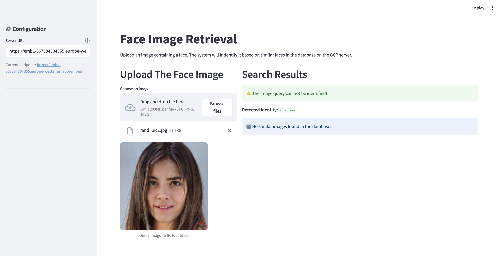
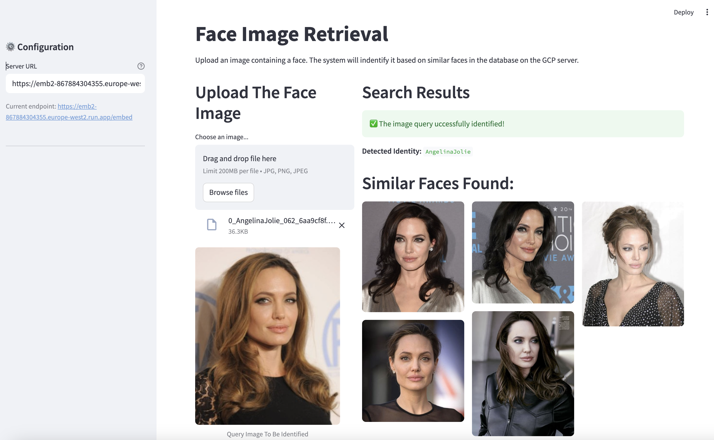

<br/> 


# Person ID Search with DeepFace, Vertex AI Vector Search, and Streamlit

This repository implements a client-server system for performing person identification searches across an image database. The server is deployed to Google Cloud Platform (GCP) using Cloud Run and utilizes Vertex AI Vector Search for efficient similarity searching. The client is a web application built with Streamlit.

## Overview

The system allows a user to query a database of face images to find the most similar identities.

1.  **Client (Streamlit):** The user uploads either a query face image or a query embedding via the Streamlit interface. The client sends this query to the server.
2.  **Server (Cloud Run):**
    * Receives the query via a POST request. The request can contain either the raw query face image (`/faceimage` endpoint) or a pre-computed embedding (`/embed` endpoint).
    * If a raw image is received, the server uses the [DeepFace](https://github.com/serengil/deepface) library to encode the face into its embedding vector.
    * The server performs a vector similarity search using [Google Cloud Vertex AI Vector Search](https://cloud.google.com/vertex-ai/docs/vector-search/overview) against an index of pre-computed embeddings from the database.
    * It retrieves the identifiers (e.g., filenames) of the K most similar images.
    * It fetches the corresponding images from Google Cloud Storage (GCS).
    * Sends the retrieved images back to the client.
3.  **Client (Streamlit):** Receives the results from the server and displays the similar images found.

## Dataset

* Both the image database and the corresponding embeddings are stored on Google Cloud.
    * Actual images reside in a Google Cloud Storage (GCS) bucket.
    * Embeddings, formatted as a `.json` file compatible with Vertex AI Vector Search, also need to be stored in GCS.
* The image dataset can contain any collection of face images.
* **For demonstration purposes:** This project uses a subset of the [Celebrity Face Image Dataset](https://www.kaggle.com/datasets/vishesh1412/celebrity-face-image-dataset). This dataset contains images of 18 Hollywood celebrities, with 100 images per celebrity. For this project, we sample 20 images from each of the 18 celebrities.

## Setup Instructions

Follow these steps to set up and run the project:

### 0. Prerequisites

* **Python Environment:** It's highly recommended to create and activate a new virtual environment (e.g., using `venv` or `conda`).
    ```bash
    python -m venv venv
    source venv/bin/activate # Linux/macOS
    # venv\Scripts\activate # Windows
    ```
* **Install Dependencies:** Install the required Python libraries from the root `requirements.txt` file.
    ```bash
    pip install -r requirements.txt
    ```
* **Google Cloud SDK (`gcloud`):** Ensure you have the [Google Cloud SDK](https://cloud.google.com/sdk/docs/install) installed and authenticated (`gcloud auth login`, `gcloud config set project YOUR_PROJECT_ID`).
* **Docker:** Ensure [Docker](https://docs.docker.com/get-docker/) is installed and running.

### 1. Prepare Dataset and Upload to GCS

First, prepare the image dataset locally, generate embeddings, and then upload everything to Google Cloud Storage.

* **Download Dataset:** Download the dataset (or your own) into a local folder (let's call it `DATASET_FOLDER`).
* **Sample Images:** Run the script to sample images (this example takes 20 per subdirectory/celebrity).
    ```bash
    python make_dataset.py DATASET_FOLDER DEST_DATASET
    ```
    Replace `DATASET_FOLDER` with the path to your downloaded dataset and `DEST_DATASET` with the desired output folder for the sampled images.
* **Create Embeddings:** Use DeepFace to encode the sampled images and save the resulting embeddings in the Vertex AI compatible JSON format.
    ```bash
    python create_embeddings.py DEST_DATASET embeddings/embeddings.json
    ```
    * This command processes images in `DEST_DATASET` and saves their embeddings to `embeddings/embeddings.json`.
    * **Important:** Vertex AI requires the embeddings file (`embeddings.json`) to be inside its own subdirectory (here named `embeddings`). Ensure this structure (`DEST_DATASET/embeddings/embeddings.json`) exists before uploading.
* **Upload to GCS:** Use the provided script to upload the sampled images (`DEST_DATASET`) and the `embeddings` folder containing `embeddings.json` to your GCS bucket.
    ```bash
    bash upload_data_GCS.bash
    ```
    This script will prompt you for:
    * Your GCS Bucket Name (e.g., `my-face-search-bucket`)
    * The local folder to upload (use `DEST_DATASET`)
    * Your GCP Project ID

    Make note of the GCS path where the `embeddings/embeddings.json` file is uploaded (e.g., `gs://my-face-search-bucket/DEST_DATASET/embeddings/`). You'll need this for the next step.

### 2. Set Up Vertex AI Vector Search

Configure Vertex AI Vector Search by creating an Index and an Index Endpoint.

* **Navigate to Vertex AI:** In the Google Cloud Console, go to `Vertex AI` > `Vector Search`.
* **Create Index:**
    * Go to the `INDEXES` tab and click `CREATE INDEX`.
    * Give your index a name (e.g., `celebrity-face-index`).
    * For `Input data`, provide the GCS path to the **folder containing** your `embeddings.json` file (e.g., `gs://my-face-search-bucket/path/to/embeddings/`).
    * Click `ADVANCED OPTIONS`.
    * Set `Distance measure type` to `Dot product distance`.
    * Set `Feature norm type` to `Unit L2 normalization`. (GCP recommends this combination over `Cosine distance` for performance, as it's mathematically equivalent when vectors are normalized).
    * Leave other settings as default unless you have specific requirements.
    * Click `CREATE`. Index creation might take some time depending on the dataset size.
* **Create Index Endpoint:**
    * Go to the `INDEX ENDPOINTS` tab and click `CREATE INDEX ENDPOINT`.
    * Pick a name (e.g., `celebrity-face-endpoint`).
    * Choose the region.
    * Leave network settings as default (Public endpoint) unless you require private access.
    * Click `CREATE`.
* **Deploy Index to Endpoint:**
    * Once both the Index and Endpoint are created, go back to the `INDEXES` tab.
    * Find your newly created Index, click the three dots (`⋮`) next to it, and select `Deploy index to endpoint`.
    * Give the deployed index a name (can be different from the index name).
    * Select the Index Endpoint you just created from the dropdown.
    * Configure machine type and autoscaling as needed (defaults are often fine for starting).
    * Click `DEPLOY`.
    * **Note:** Linking the index to the endpoint can take 10-30 minutes or more. Wait until the deployment is complete and the endpoint shows the deployed index.


### 3. Configure Server Settings

Before building the server's Docker image, you **must** update the configuration variables in the `server/utils.py` file to match your GCP environment setup.

* **Edit the file:** Open `server/utils.py` in a text editor.
* **Update the following variables:**
    * `PROJECT_ID`: Set this to your Google Cloud Project ID.
    * `REGION`: Set this to the GCP region where you created your Vertex AI Index Endpoint (e.g., 'us-central1').
    * `INDEX_ENDPOINT_ID`: Set this to the numerical ID of the Vertex AI Index Endpoint you created in Step 2.
    * `DEPLOYED_INDEX_ID`: Set this to the ID you assigned to the deployed index when linking the Index to the Endpoint in Step 2 (e.g., 'deployed_celebrity_index_001').
    * `BUCKET_NAME`: Set this to the name of the GCS bucket where you uploaded your dataset (e.g., 'faceverification_me').
    * `DATASET_ADD`: Set this to the relative path *within* the bucket where the image folders are located (e.g., 'CelebrityFacesmall/'). Make sure it ends with a `/`.
    * `NUM_NEIGHBORS`: (Optional) Adjust the number of similar images (neighbors) the search should return. The default is 5.

* **Save the changes** to `server/utils.py`.

### 4. Build the Server Docker Image

Now, build the Docker image for the server application located in the `server/` directory. This image will include the configuration changes you just made.

* **On Linux:**
    ```bash
    docker build -t MY_IMAGE_NAME server
    ```
* **On Mac (Apple Silicon M1/M2/M3):** You might need `buildx` to build for the target `linux/amd64` architecture used by Cloud Run.
    ```bash
    docker buildx build --platform linux/amd64 -t MY_IMAGE_NAME server
    ```
* **IMPORTANT:** If you don't have access to an instance on GCP with GPUs, you should let the client handle the extraction of the embedding, and query the server with the embedding. In this case, you should remove lines `tensorflow==2.13` and `deepface` from server/requirements.txt before building the Docker image.


### 5. Push the Server Image to Artifact Registry

Push the built Docker image to Google Cloud Artifact Registry. The `push_docker.bash` script automates this process, including tagging the image, creating the Artifact Registry repository if it doesn't exist, and handling Docker authentication with GCP.

* **Run the script:**
    ```bash
    bash push_docker.bash
    ```
* **Provide Information:** The script will prompt you for the following details:
    * **Project ID:** Your Google Cloud Project ID.
    * **GCP Location:** The region for your Artifact Registry (e.g., `us-central1`).
    * **Repository Name:** The name you want for your Artifact Registry repository (e.g., `my-docker-repo`).
    * **Local Docker Image Name:** The name you used when building the image in the previous step (e.g., `face-search-server`).
    * **Local Docker Image Tag:** The tag for your local image (defaults to `latest` if you press Enter).
* **Confirmation:** The script will display the details and ask for confirmation before proceeding.
* **Actions Performed:** The script will then:
    * Check if the local image exists.
    * Check if the Artifact Registry repository exists in the specified location and create it if necessary.
    * Configure Docker to authenticate with your Artifact Registry.
    * Tag your local image with the full Artifact Registry path (e.g., `us-central1-docker.pkg.dev/YOUR_PROJECT_ID/my-docker-repo/face-search-server:latest`).
    * Push the tagged image to Artifact Registry.
 

### 6. Deploy the Server using Google Cloud Run

Deploy the container image from Artifact Registry to Cloud Run using the `deploy_GCP.bash` script. This script automates the deployment process.

* **Ensure Project ID is Set:** The script first checks if your GCP Project ID is configured in `gcloud`. If not, set it using `gcloud config set project YOUR_PROJECT_ID`.
* **Run the script:**
    ```bash
    bash deploy_GCP.bash
    ```
* **Provide Information:** The script will prompt you for:
    * **GCP Location:** The region where your Artifact Registry repository exists (e.g., `us-central1`). This will also be the region where the Cloud Run service is deployed.
    * **Repository Name:** The name of your Artifact Registry repository (e.g., `my-docker-repo`).
* **Select Image:** The script will list the unique image names found in your specified repository and prompt you to select the one you want to deploy by entering its corresponding number. It assumes the `latest` tag for the selected image.
* **Provide Service Name:** You will be prompted to enter a name for your new Cloud Run service (e.g., `face-search-service`).
* **Deployment:** The script then executes `gcloud run deploy` with the following settings:
    * `--platform=managed`
    * `--memory=4Gi`
    * `--cpu=1`
    * `--allow-unauthenticated` (Allows public access to the service URL)
    * **Note:** The memory (8Gi) and CPU (2) settings are relatively high. You might want to adjust these values in the `deploy_GCP.bash` script if your application requires fewer resources.
* **Service URL:** Upon successful deployment, the script (via `gcloud`) will output the **Service URL**. **Copy this URL**, as you will need it for the client.
* **IMPORTANT:** if you want to send the actual image to the server so that the server will handle the embedding part, you should deploy your image to an instance on GCP with GPUs (required by DeepFace). In this case, the line 113 in deploy_GCP.bash should be replace with the following before running it (you can customize the machine settings). YOUR_GPU_TYPE and YOUR_GPU_COUNT should be set as per your requirements.
  ```bash
   gcloud run deploy $YOUR_SERVICE_NAME  --image=$SELECTED_IMAGE_PATH  --region=$LOCATION --platform=managed --memory=8Gi --cpu=2 --allow-unauthenticated --accelerator type=YOUR_GPU_TYPE,count=YOUR_GPU_COUNT
  ```
    

### 7. Configure IAM Permissions (Crucial!)

The Cloud Run service needs permission to access other GCP services (GCS for images, Vertex AI for vector search). By default, Cloud Run services run using the **Compute Engine default service account**. You must grant this account the necessary roles.

* **Identify Service Account:** Find your Compute Engine default service account email. It usually looks like `YOUR_PROJECT_NUMBER-compute@developer.gserviceaccount.com`. You can find `YOUR_PROJECT_NUMBER` on the Google Cloud Console dashboard.
* **Grant Roles:** Go to `IAM & Admin` > `IAM` in the Google Cloud Console.
    * Find the Compute Engine default service account principal.
    * Click the pencil icon (Edit principal).
    * Click `ADD ANOTHER ROLE` and add the following roles:
        * `Vertex AI User` (Provides permissions to query Vertex AI endpoints)
        * `Storage Object Viewer` (Allows reading images and embedding files from GCS)
    * *(Optional - Broader Access for Simplicity during setup)* For easier setup, you *could* grant broader roles like `Vertex AI Administrator` and `Storage Admin`, but this is **not recommended for production** due to security risks. Stick to the principle of least privilege (`Vertex AI User`, `Storage Object Viewer`) if possible.
    * Click `SAVE`.

    **Failure to set these permissions correctly will likely cause the server to fail when trying to access GCS or Vertex AI.**

## Running the Client

The client is a Streamlit web application located in the `client/` directory.

1.  **Run Streamlit:** Start the client application.
    ```bash
    streamlit run client/client.py
    ```
2.  **Use the App:**
    * Your web browser should open with the Streamlit app.
    * Enter the **Server URL** (the one you copied from the Cloud Run deployment step) into the input field. Make sure it's the full URL (e.g., `https://your-service-name-randomhash-region.a.run.app`).
    * Upload a query face image.
    * Click the button to send the request. The client allows choosing between:
        * Sending the **raw image** (uses the `/faceimage` endpoint on the server, server handles embedding).
        * Sending the **embedding** (uses the `/embed` endpoint on the server, client computes embedding first). In this case, it will use DeepFace library. 
    * The retrieved similar images from the database will be displayed.
